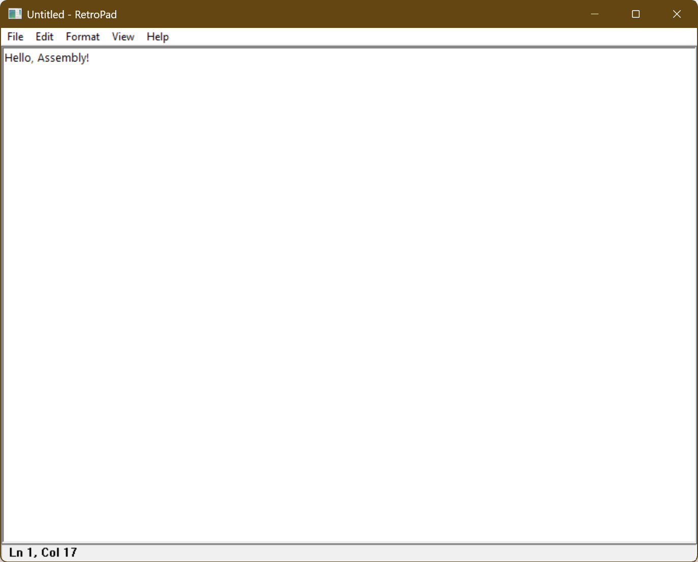

<!-- markdownlint-disable MD041 -->
```ascii
  _____      _             _____          _
 |  __ \    | |           |  __ \        | |
 | |__) |___| |_ _ __ ___ | |__) |_ _  __| |
 |  _  // _ \ __| '__/ _ \|  ___/ _` |/ _` |
 | | \ \  __/ |_| | | (_) | |  | (_| | (_| |
 |_|  \_\___|\__|_|  \___/|_|   \__,_|\__,_|
 T I N Y  X 86   D E S K T O P   E D I T O R
```

# TinyRetroPad

A working, Notepad-style Windows text editor in roughly 2.5 KB.

Compiles with: MASM and Crinkler.

TinyRetroPad is a fork of **Dave's Tiny Editor (DTE)** by Matt Power, which is itself an extension of `tiny.asm` [HelloAssembly](https://github.com/PlummersSoftwareLLC/HelloAssembly) by [Dave Plummer](https://github.com/davepl). The original goal was a working windowed text editor in the sub-1KB category; TinyRetroPad keeps that minimalist, size-obsessed spirit while filling out a full Notepad-style menu set (File / Edit / Format / View / Help) on top of it. It uses [Crinkler](https://github.com/runestubbe/Crinkler) compression at build time.

TinyRetroPad is basically a wrapper around the RICHEDIT50W control from the WinAPI. DTE versions 1.0+ used the EDIT control with Crinkler cranked and were built up from tiny.asm, then worked down to 890 bytes with Win Defender quite unhappy. Versions 2.0+ backed Crinkler off a bit and use RICHEDIT to gain cheaper access to Courier font and much larger files; 2.0+ was worked down from 995 to 981 bytes as a bare editor. TinyRetroPad then grows from that 981-byte base by adding real menus and dialogs — Open/Save/Save As, Print/Page Setup, Find/Replace/Go To, Font, Word Wrap, Time/Date, and a Ln/Col status bar — landing near 2,476 bytes. Each addition was kept as cheap as possible; the growth log at the top of [trpad.asm](trpad.asm) records what every feature cost in bytes.

**Important:** Programs using Crinkler can be flagged as a false positive by antivirus, including Windows Defender. You may need to make an antivirus exception folder to build this (especially for 1.0+), or Windows may delete the EXE as soon as the build completes. Therefore, try this out AT YOUR OWN RISK - NO WARRANTIES / NO GUARANTEES. You can accomplish this with PowerShell, but I am not going to tell you how. Sorry. You're on your own when messing with antivirus.

- MASM version used: Microsoft (R) Macro Assembler Version 14.44.35224.0

- MASM can vary depending on version. If you experience:

  ```console
  C:\masm32\include\winextra.inc(11052) : error A2026:constant expected
  C:\masm32\include\winextra.inc(11053) : error A2026:constant expected
  ```

  In masm32\include\winextra.inc change:

  ```assembly
      STD_ALERT struct
          alrt_timestamp dd ?
          alrt_eventname WCHAR  [EVLEN + 1] dup(?)
          alrt_servicename WCHAR [SNLEN + 1] dup(?)
      STD_ALERT ends
  ```

  to:

  ```assembly
      STD_ALERT struct
          alrt_timestamp dd ?
          alrt_eventname WCHAR  (EVLEN + 1) dup(?)
          alrt_servicename WCHAR (SNLEN + 1) dup(?)
      STD_ALERT ends
  ```

  The brackets on lines 13,14 were changed to parens.

- `build.bat` contains: /LIBPATH:"C:\Program Files (x86)\\Windows Kits\\10\\Lib\\10.0.20348.0\\um\\x86"
  You may need to change to fit your system: /LIBPATH:"...\\Windows Kits\\10\\Lib\\(your version)\\um\\x86"

- You need to have Crinkler installed in a directory that has been added to PATH.
  Example: C:\utils\Crinkler.exe

## Contents

| Folder | Description |
| - | - |
| `1_0` | DTE Version 1.0 aggressive 890 bytes build. Needs AV exception to be usable. |
| `2_0_BACKUPS` | DTE Version 2.0 bare editor, 981 bytes build from RICHEDIT to release. |

| File | Description |
| - | - |
| `build.bat` | Builds TinyRetroPad from command line. |
| `DRAG ME ONTO DTE.txt` | How to use the editor. |
| `DTE ABOUT.txt` | Explains some design decisions. |
| `trpad.asm` | The program. TinyRetroPad, forked from DTE 2.0.9 |
| `LICENSE.TXT` | Usage permissions (Apache License 2.0). |

## Building the menus and Notepad features

Everything past the bare RICHEDIT wrapper is built up the same way: keep the control doing the heavy lifting, and let the WinAPI common dialogs and a few `SendMessage` calls supply the rest. Almost every "feature" is just a menu ID routed to a one- or two-instruction handler, so the byte cost stays tiny. The
growth log at the top of [trpad.asm](trpad.asm) tracks what each addition cost.

### The menu bar

The whole menu bar is assembled at startup in `CreateNotepadMenus`:

- `CreateMenu` makes the top-level bar, then each drop-down is a
  `CreatePopupMenu`.
- Items are added with two thin wrappers, `AppendEnabled` and
  `AppendDisabled`, that call `AppendMenuA`. `AppendDisabled` with a null
  string draws the separator lines, which avoids carrying a separate separator
  call.
- Every menu label lives as a packed `db` string (`MFile`, `MNew`, `MOpen`, etc.) and every command is a constant ID (`IDM_FILE_OPEN`, `IDM_EDIT_FIND`, …). `SetMenu` attaches the finished bar to the main window.
- The same IDs power the right-click context menu via `TrackPopupMenu`, so the context menu costs almost nothing extra.

The classic `Save` item is appended onto the window's **system menu** with
`GetSystemMenu`/`AppendMenuA`, which is why it arrives as a `WM_SYSCOMMAND` instead of a `WM_COMMAND`.

### Routing commands

In `WndProc`, `WM_COMMAND` extracts the low word of `wParam` and runs it down a flat list of `cmp`/`je` checks straight to each `Cmd…` handler. Most handlers just forward an EDIT/RICHEDIT message and return:

| Menu | How it works |
| - | - |
| **Edit → Undo / Cut / Copy / Paste / Delete / Select All** | Single `SendMessageA` of the matching `WM_UNDO` / `WM_CUT` / `WM_COPY` / `WM_PASTE` / `WM_CLEAR` / `EM_SETSEL` message to the control. |
| **Edit → Time/Date** | `InsertTimeDate` calls `GetLocalTime` + `GetTimeFormatA`/`GetDateFormatA`, then replaces the selection with `EM_REPLACESEL`. |

### File: New / Open / Save / Save As

The file commands are driven by the common dialogs so we never hand-roll a
file picker:

- **Open** (`PickOpenFile`) and **Save As** (`PickSaveFile`) call
  `GetOpenFileNameA` / `GetSaveFileNameA` with a single all-files filter and store the chosen path in `CmdFile`. Open then reuses the existing `LoadStartupFile` path that the drag-and-drop launch already used.
- Loading/saving the actual bytes goes through `CreateFileA`, `GetFileSize`, `GlobalAlloc`, `ReadFile`/`WriteFile`, and `CloseHandle` — the same plumbing the original drop-file editor used, now shared by the menus.
- A `fDirty` flag (set on `EN_CHANGE`) drives the title-bar `*` and the `MaybeSaveChanges` "Save changes?" prompt that New / Open / Exit run before discarding the buffer.

### File: Page Setup and Print

Printing leans entirely on RICHEDIT's own renderer:

- **Page Setup** (`PageSetup`) just shows `PageSetupDlgA`.
- **Print** (`PrintDoc`) calls `PrintDlgA` to get a printer DC, queries it with `GetDeviceCaps`, then asks the control to lay text onto that DC with `EM_FORMATRANGE`, looping `StartPage`/`EndPage` until the whole document is emitted, wrapped in `StartDocA`/`EndDoc` and released with `DeleteDC`. No GDI text drawing of our own is required.

### Edit: Find / Find Next / Replace / Go To

- **Find / Replace** use the modeless common dialogs `FindTextA` /
  `ReplaceTextA`. Because they are modeless, the message loop calls
  `IsDialogMessageA` for the dialog, and the actual searching happens when the registered `FINDMSGSTRING` message (`uFindMsg`, fetched via `RegisterWindowMessageA`) arrives at `OnFindReplaceMsg`. `DoFindNext`, `DoReplaceOne`, and `DoReplaceAll` then drive selection via `EM_FINDTEXTEX`
  and `EM_REPLACESEL`.
- **Go To** uses an in-memory dialog template (`GoToTmpl`) shown with `DialogBoxIndirectParamA`, reads the line number with `GetDlgItemInt`, and scrolls there with `EM_LINEINDEX` + `EM_SETSEL`. Building the template in memory avoids a `.rc` resource and its overhead.

### Format: Word Wrap and Font

- **Word Wrap** (`ToggleWrap`) flips `fWrap` and re-targets the control's wrap width with `EM_SETTARGETDEVICE`.
- **Font** (`ChooseFontDlg`) shows `ChooseFontW` and applies the result through `EM_SETCHARFORMAT` — the same mechanism used to force Courier at startup, which is why no `gdi32` import is needed.

### View: Status Bar

The status bar is a plain `STATIC` child window created with `CreateWindowExA`. `UpdateStatus` reads the caret with `EM_EXGETSEL`, converts it to a line with `EM_EXLINEFROMCHAR` and a column with `EM_LINEINDEX`, formats `Ln %d, Col %d` with `wsprintfA`, and pushes it in with `SetWindowTextA`. The **Status Bar** menu item toggles `fStatus` and calls `ShowWindow`, while `RelayoutClient` resizes the editor and bar together on `WM_SIZE`.

### Help

**About** is a one-line `MessageBoxA`, and **View Help** opens the project URL in the default browser via `ShellExecuteA` — both cheaper than bundling any help content.

## Credits

- **TinyRetroPad** — fork adding the full Notepad-style menu set and dialogs.
- **Dave's Tiny Editor (DTE)** — Matt Power, the sub-1KB RICHEDIT editor this fork is built on.
- **`tiny.asm` / [HelloAssembly](https://github.com/PlummersSoftwareLLC/HelloAssembly)** — [Dave Plummer](https://github.com/davepl), the original foundation.

## TinyRetroPad in use


